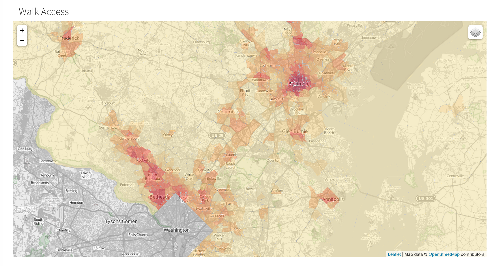

# Maryland Employment & Labor Accessibility

This repository contains three python scripts for computing walk and bike access
 to jobs and labor in the state of Maryland.

 The scripts will calculate three measures of accessibility using
 flat, linear, and exponential decay functions, the results of which will look something like this:

 

*note*: an interactive version can be found [here](http://knaaptime.com/maps/mdot/index.html)

 Accessibility is computed using the
 [pandana](http://synthicity.github.io/pandana/) network analysis library, and
  [geopandas](http://geopandas.org/) is used to read and write shapefile data.
  See the respective webpages for instructions on installing the libraries and their
   dependencies

To run the scripts, first download the [data](https://www.dropbox.com/s/y2zg1o5mwaluufb/md_accessibility_input.zip?dl=0),
 unzip it, and place the "input" directory in the root of this folder. The input
 directory contains a shapefile with LEHD data that has been slightly modified to
 account for some known issues, and a walk/bike network extract from OpenStreetMap (thanks to
   Fletcher Foti for helping to create the network). Then, open a terminal, cd into this folder, and run
    each script using, e.g.:
    `python access_exponential.py`

*note*: There is also a script called "build_osm.py" that could build a network from
scratch using pandana's OSM loader, although currently there are [some problems](https://github.com/synthicity/pandana/issues/41)
 because of the network's size. For now, it's probably best to use the data provided above.  

Each script takes about 15-20 minutes to run on my macbook with 16gb of RAM; they may
take longer depending on your system configuration. When finished, each script will produce a
 CSV and block group level shapefile in the "output" directory
